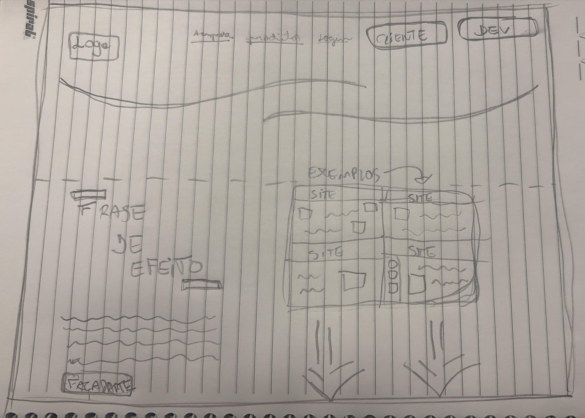

# SITE WEB - Projeto Extensionista

#Sobre o projeto
O projeto consiste no desenvolvimento de uma plataforma web que tem como objetivo conectar pessoas que precisam de um site a programadores capazes de desenvolver essa solução.
A plataforma busca facilitar o contato entre clientes e desenvolvedores, permitindo que o usuário encontre profissionais de acordo com critérios como preço e prazo de desenvolvimento.
Além disso, o cliente poderá apresentar referências visuais do site que deseja desenvolver, enviando imagens ou referências de outros sites para demonstrar ao programador o estilo, layout ou modelo que pretende utilizar.




#Equipe
-Vinicius Alves / RA:10771489
-Pedro Jobe / RA:10743750
-Diego Campos / RA: 10771507
-Nicolas Braga / RA:10777202


# Estrutura Principal do Site - Projeto Extensionista

Este documento apresenta as seções essenciais do HTML, acompanhadas de explicações sobre suas funções.

---

## 1. Cabeçalho da Página (`<header>`)

Define o topo da página, contendo a marca, o menu de navegação e os botões de perfil.

```html
<header>
    <figure>
        <span>M</span>
        <figcaption>Mackenzie</figcaption>
    </figure>

    <nav>
        <ul>
            <li><a href="#sobre">Sobre</a></li>
            <li><a href="#produtos">Produtos</a></li>
            <li><a href="#login">Login</a></li>
        </ul>
    </nav>

    <div>
        <a href="#cliente">CLIENTE</a>
        <a href="#dev">DEV</a>
    </div>
</header>
```

**Explicação:**
* `<figure>`: Agrupa o logotipo e a marca visual da empresa.
* `<nav>` e `<ul>`: Estruturam o menu de navegação principal com links para seções internas.
* `<div>`: Agrupa os botões de seleção de perfil de acesso (`CLIENTE` e `DEV`).

---

## 2. Seção Principal de Apresentação (`Hero Section`)

É o primeiro bloco de conteúdo que o usuário visualiza ao acessar a página.

```html
<section>
    <h1>FAÇA PARTE DO PROJETO EXTENSIONISTA</h1>
    <p>EX...</p>
    <a href="#fale-conosco">FALE COM UM PROGRAMADOR</a>
</section>
```

**Explicação:**
* `<h1>`: Título principal (elemento de maior hierarquia visual e de SEO).
* `<p>`: Texto introdutório com a descrição do projeto.
* `<a>`: Botão de chamada para ação (*Call to Action*), direcionando o usuário para falar com um programador.

---

## 3. Seção de Portfólio de Projetos (`<section>`)

Apresenta a lista ou grade de projetos desenvolvidos.

```html
<section>
    <header>
        <h2>EXEMPLOS DE PROJETOS</h2>
    </header>

    <div>
        <article>
            <h3>SITE 1</h3>
            <div>
                <p>Linhas de texto</p>
                <p>Linhas de texto</p>
            </div>
        </article>
    </div>
</section>
```

**Explicação:**
* `<h2>`: Título secundário que identifica o bloco de projetos.
* `<article>`: Representa um bloco independente de conteúdo (neste caso, um cartão contendo informações de um projeto específico).
* `<h3>` e `<p>`: Organizam o título do projeto e suas informações detalhadas.
