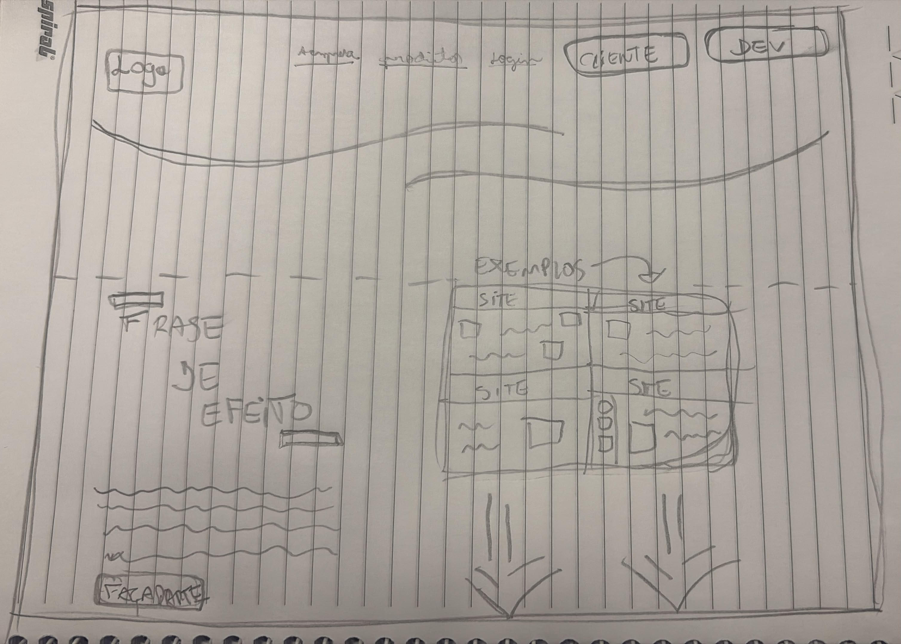

# SITE WEB - Projeto Extensionista

## Sobre o projeto

Este projeto consiste no desenvolvimento de um site para apresentação de projetos desenvolvidos por um profissional da área de tecnologia. A plataforma reúne, em um único ambiente digital, informações sobre os trabalhos realizados, permitindo que visitantes conheçam as soluções desenvolvidas e, havendo interesse, entrem em contato diretamente com o responsável.

A navegação começa pela página inicial, onde o projeto é apresentado e seu funcionamento é explicado em etapas sequenciais, guiando o visitante desde o primeiro acesso até o contato com o desenvolvedor. Para acessar a área de projetos, o usuário passa por um sistema de autenticação com páginas de login e cadastro, que inclui validação dos dados informados, como a verificação de um tamanho mínimo de senha e a conferência entre senha e confirmação de senha antes de liberar o acesso. Já dentro da área de projetos, os trabalhos são exibidos em formato de cartões, com recursos de filtragem por tecnologia utilizada e ordenação alfabética, o que permite ao visitante localizar com mais facilidade as soluções de seu interesse. A partir da lista, é possível abrir a visualização detalhada de cada projeto, que traz informações complementares como descrição estendida, tecnologias empregadas, prazo de desenvolvimento e valor estimado.

Além de seu funcionamento como produto, este projeto se caracteriza como uma atividade extensionista por representar a aplicação prática de conhecimentos técnicos desenvolvidos ao longo da disciplina de Web Mobile em uma ferramenta real e acessível a qualquer pessoa externa à universidade. Diferente de um exercício acadêmico que se encerra na entrega e correção, o site permanece disponível e utilizável depois disso, cumprindo uma função concreta para quem o acessa. Ele aproxima, de forma direta, quem possui capacidade técnica para desenvolver soluções web de quem precisa delas, reduzindo a dificuldade natural de encontrar e avaliar um desenvolvedor de confiança ao reunir, em um só lugar, exemplos de trabalho, tecnologias utilizadas, prazos e valores. Dessa forma, o projeto cumpre o papel central da extensão universitária, que é o de estabelecer uma ponte entre o conhecimento produzido dentro da universidade e uma necessidade real da comunidade fora dela, colocando a formação acadêmica do desenvolvedor a serviço de um público concreto.


O projeto utiliza **HTML, CSS e JavaScript**. O JavaScript é utilizado para:

* controlar a aparição dos elementos durante o scroll;
* criar dinamicamente os cards de projetos;
* converter os dados armazenados em JSON;
* criar os filtros de tecnologia;
* filtrar projetos;
* ordenar projetos por nome;
* abrir a página de detalhes de um projeto;
* voltar para a lista de projetos;
* validar o Login;
* validar o Cadastro;
* verificar o tamanho das senhas;
* verificar se as senhas do cadastro são iguais.

Os projetos possuem valores, prazos e números de contato fictícios apenas para demonstração da interface.

---

## Equipe

* Vinicius Alves / RA: 10771489
* Pedro Jobe / RA: 10743750
* Diego Campos / RA: 10771507
* Nicolas Braga / RA: 10777202

---

## Wireframe



---

# Estrutura de arquivos

O projeto possui quatro páginas HTML e arquivos CSS e JavaScript responsáveis pela estrutura, estilização e funcionalidades:

| Página | HTML | CSS | JavaScript |
|---|---|---|---|
| Home | `index.html` | `style.css` | `script.js` |
| Login | `login.html` | `stylelogin.css` | `validacao.js` |
| Cadastro | `registrar.html` | `styleregistrar.css` | `validacao.js` |
| Produtos / Projetos | `produtos.html` | `style.css` + `styleprodutos.css` | `script.js` + `script-produtos.js` |

Também fazem parte do projeto:

* `imagem-fundo.jpg` — imagem utilizada no banner da Home;
* `IMG_4902.jpeg` — imagem utilizada como material de apoio/wireframe;
* `README.md` — documentação do projeto.

---

# Principais alterações da versão atual

## 1. Mudança na proposta do site

A proposta do site foi alterada.

Anteriormente, a ideia era representar uma plataforma com vários desenvolvedores, na qual o cliente poderia procurar diferentes profissionais.

Na versão atual, existe **um único desenvolvedor**.

Todos os projetos exibidos pertencem ao mesmo profissional.

Isso também foi refletido nos textos da Home e da página de projetos.

Por exemplo, a página `produtos.html` apresenta:

```html
<p class="fade-item">
    Conheça os projetos desenvolvidos por um único profissional,
    responsável por todas as soluções apresentadas no site.
</p>
```

**Explicação:**

* `<p>` cria um parágrafo.
* `class="fade-item"` permite que o texto participe da animação controlada pelo `script.js`.
* O texto informa que os projetos pertencem a um único profissional.
* A expressão "todas as soluções apresentadas no site" deixa claro que não existe uma lista de desenvolvedores diferentes.

---

## 2. Alteração dos cinco passos

A seção "Como Funciona" também foi adaptada para a nova proposta.

Os cinco passos atuais são:

1. Conheça o projeto;
2. Escolha seu acesso;
3. Conheça os projetos;
4. Conheça o desenvolvedor;
5. Entre em contato.

Além da mudança dos textos, todos os cinco itens possuem a classe `fade-item`.

Isso permite que eles apareçam gradualmente conforme o usuário rola a página.

---

## 3. Animação durante o scroll

A classe:

```html
class="fade-item"
```

é utilizada nos elementos que devem aparecer gradualmente.

No CSS:

```css
.fade-item {
    opacity: 0;
    transition: opacity 0.6s ease;
}
```

Os elementos começam invisíveis com:

```css
opacity: 0;
```

Depois, o JavaScript altera a opacidade para:

```css
opacity: 1;
```

A alteração é feita conforme o usuário rola a página.

---

## 4. Remoção do espaço reservado para imagem do projeto

Na Home, o card de exemplo anteriormente possuía uma área separada para uma imagem.

Na versão atual, essa área foi removida.

O card agora possui diretamente:

* nome;
* descrição;
* tecnologias;
* botão de acesso.

O HTML atual é:

```html
<article class="card-projeto fade-item">
    <div class="card-projeto-conteudo">
        <h3>Nome do Projeto</h3>
        <p>
            Exemplo de uma solução desenvolvida pelo responsável
            pelo site. Aqui você pode conhecer a proposta,
            as tecnologias utilizadas e entrar em contato caso
            tenha interesse em um projeto semelhante.
        </p>

        <ul class="tecnologias">
            <li>HTML</li>
            <li>CSS</li>
            <li>JavaScript</li>
        </ul>

        <a href="login.html" class="link-projeto">
            VER PROJETO
        </a>
    </div>
</article>
```

Não existe mais:

```html
<div class="card-projeto-imagem"></div>
```

Portanto, não é reservado espaço vazio para uma imagem.

---

# Página Inicial (`index.html`)

## 5. Estrutura básica do HTML

O documento começa com:

```html
<!DOCTYPE html>
<html lang="pt-BR">
```

### `<!DOCTYPE html>`

Informa ao navegador que o documento utiliza HTML5.

### `<html lang="pt-BR">`

É o elemento principal do documento.

O atributo:

```html
lang="pt-BR"
```

indica que o conteúdo está em português do Brasil.

---

## 6. Cabeçalho do documento

```html
<head>
    <meta charset="UTF-8">

    <meta
        name="viewport"
        content="width=device-width, initial-scale=1.0"
    >

    <link rel="stylesheet" href="style.css">

    <title>
        Home - Projeto Extensionista | myIT
    </title>
</head>
```

### `meta charset`

```html
<meta charset="UTF-8">
```

Define a codificação dos caracteres.

Isso permite utilizar corretamente letras acentuadas e caracteres especiais.

### `meta viewport`

```html
<meta
    name="viewport"
    content="width=device-width, initial-scale=1.0"
>
```

É utilizada para melhorar a adaptação da página em dispositivos móveis.

### `link`

```html
<link rel="stylesheet" href="style.css">
```

Conecta o HTML ao arquivo CSS da página inicial.

### `title`

Define o título que aparece na aba do navegador.

---

# 7. Cabeçalho da Home

O cabeçalho é:

```html
<header class="header-site">

    <a href="index.html">
        <span class="logo-icone">M</span>
        <span class="nome-logo">myIT</span>
    </a>

    <nav class="navegacao">
        <ul>
            <li>
                <a href="login.html">Produtos</a>
            </li>
        </ul>
    </nav>

    <div class="acoes-topo">
        <a href="login.html" class="btn-entrar">
            ENTRAR
        </a>
    </div>

</header>
```

### `<header>`

Representa o cabeçalho da página.

A classe:

```html
header-site
```

é utilizada pelo CSS para organizar o layout.

### Logo

```html
<a href="index.html">
```

O logo é um link para a própria página inicial.

O elemento:

```html
<span class="logo-icone">M</span>
```

representa o ícone da marca.

Já:

```html
<span class="nome-logo">myIT</span>
```

mostra o nome do projeto.

### Navegação

```html
<nav class="navegacao">
```

Representa a área de navegação.

O link direciona para:

```html
login.html
```

### Botão de entrada

```html
<a href="login.html" class="btn-entrar">
    ENTRAR
</a>
```

Direciona o usuário para a página de Login.

---

# 8. Banner / Hero

```html
<section class="hero">

    <div class="hero-conteudo">

        <h1 class="fade-item">
            FAÇA PARTE DO PROJETO EXTENSIONISTA
        </h1>

        <a href="registrar.html" class="fade-item">
            FAÇA PARTE!
        </a>

        <span class="descubra-mais fade-item">
            <span class="seta">↓</span>
            Mais informações abaixo
        </span>

    </div>

</section>
```

### `<section class="hero">`

Representa a área principal da Home.

A imagem de fundo é definida no CSS.

### `<h1>`

Apresenta o título principal.

A classe:

```html
fade-item
```

faz com que o título participe da animação.

### Link "FAÇA PARTE!"

```html
<a href="registrar.html">
```

Direciona o usuário para o cadastro.

### "Mais informações abaixo"

```html
<span class="descubra-mais fade-item">
```

Mostra uma indicação visual para que o usuário continue descendo a página.

---

# 9. Seção "Como Funciona"

```html
<section class="sobre" id="sobre">

    <h2 class="fade-item">
        COMO FUNCIONA
    </h2>

    <ol class="passos">
```

A seção explica o funcionamento do site.

O elemento:

```html
<ol>
```

representa uma lista ordenada.

Porém, a numeração visual é criada manualmente através de:

```html
<span class="passo-numero">
```

---

## 10. Passo 1

```html
<li class="passo fade-item">

    <span class="passo-numero">1</span>

    <h3>
        Conheça o projeto
    </h3>

    <p>
        Assim que você chega ao site, apresentamos o Projeto
        Extensionista e mostramos os projetos desenvolvidos por
        um único desenvolvedor, responsável pela criação e
        manutenção das soluções apresentadas.
    </p>

</li>
```

### `<li>`

Representa um item da lista.

### `.passo`

Aplica o estilo visual do card.

### `.fade-item`

Faz com que o passo seja controlado pelo JavaScript.

### `.passo-numero`

Mostra o número do passo.

### `<h3>`

Apresenta o título.

### `<p>`

Apresenta a explicação do passo.

---

# 11. Passo 2

```html
<li class="passo fade-item">

    <span class="passo-numero">2</span>

    <h3>
        Escolha seu acesso
    </h3>

    <p>
        Você faz login ou cadastro para acessar a área de
        projetos e conhecer as soluções desenvolvidas pelo
        responsável pelo site.
    </p>

</li>
```

O segundo passo explica que o visitante pode fazer Login ou Cadastro.

O item também possui:

```html
class="passo fade-item"
```

Portanto, participa da animação.

---

# 12. Passo 3

```html
<li class="passo fade-item">

    <span class="passo-numero">3</span>

    <h3>
        Conheça os projetos
    </h3>

    <p>
        Após entrar, você acessa uma área central com os
        projetos desenvolvidos pelo mesmo profissional,
        podendo conhecer os detalhes de cada solução.
    </p>

</li>
```

O terceiro passo explica o acesso aos projetos.

O texto deixa explícito:

```text
pelo mesmo profissional
```

Isso reforça a nova proposta do projeto.

---

# 13. Passo 4

```html
<li class="passo fade-item">

    <span class="passo-numero">4</span>

    <h3>
        Conheça o desenvolvedor
    </h3>

    <p>
        Todos os projetos apresentados pertencem ao mesmo
        desenvolvedor, que concentra suas experiências,
        tecnologias utilizadas e informações de contato.
    </p>

</li>
```

O quarto passo apresenta o profissional responsável pelos projetos.

A ideia de vários desenvolvedores foi retirada.

---

# 14. Passo 5

```html
<li class="passo fade-item">

    <span class="passo-numero">5</span>

    <h3>
        Entre em contato
    </h3>

    <p>
        Ao se interessar por um projeto, você pode consultar
        as informações apresentadas e entrar em contato
        diretamente com o desenvolvedor responsável pela solução.
    </p>

</li>
```

O quinto passo mostra a finalidade principal da apresentação dos projetos: permitir que uma pessoa interessada entre em contato com o profissional.

---

# 15. Card de exemplo da Home

```html
<section class="projetos" id="produtos">

    <header>
        <h2 class="fade-item">
            EXEMPLO DE PROJETO
        </h2>
    </header>

    <article class="card-projeto fade-item">

        <div class="card-projeto-conteudo">

            <h3>Nome do Projeto</h3>

            <p>
                Exemplo de uma solução desenvolvida pelo
                responsável pelo site. Aqui você pode conhecer
                a proposta, as tecnologias utilizadas e entrar
                em contato caso tenha interesse em um projeto semelhante.
            </p>

            <ul class="tecnologias">
                <li>HTML</li>
                <li>CSS</li>
                <li>JavaScript</li>
            </ul>

            <a href="login.html" class="link-projeto">
                VER PROJETO
            </a>

        </div>

    </article>

</section>
```

### `<article>`

Representa o card do projeto.

### `.card-projeto-conteudo`

Contém todas as informações textuais.

### `.tecnologias`

É uma lista com as tecnologias utilizadas.

### `.link-projeto`

É o botão visual para acessar o fluxo do projeto.

A área de imagem foi retirada desse card.

---

# 16. Rodapé

```html
<footer class="rodape-site">
    <p>
        &copy; 2026 Projeto Extensionista - myIT
    </p>
</footer>
```

### `<footer>`

Representa o rodapé.

### `&copy;`

Exibe o símbolo de copyright:

```text
©
```

---

# `script.js` — Animação dos elementos

O arquivo `script.js` é responsável pela animação dos elementos que possuem a classe `fade-item`.

O código completo é:

```js
// Faz os elementos "fade-item" aparecerem conforme a página é rolada
const itens = document.querySelectorAll(".fade-item");

function mostrarItens() {
    // limite = até onde a tela já chegou (topo da tela + altura da tela)
    const limite = window.scrollY + window.innerHeight - 50;

    for (let i = 0; i < itens.length; i++) {
        if (itens[i].offsetTop < limite) {
            itens[i].style.opacity = "1";
        }
    }
}

// Evento: toda vez que o usuário rola a página
window.onscroll = mostrarItens;

// Roda uma vez ao carregar, para mostrar o que já está na tela
mostrarItens();
```

---

## 17. Selecionando os elementos

```js
const itens = document.querySelectorAll(".fade-item");
```

### `document`

Representa o documento HTML carregado no navegador.

### `querySelectorAll()`

Procura todos os elementos que possuem:

```css
.fade-item
```

### `const itens`

Armazena os elementos encontrados.

Assim, todos os títulos, cards e passos que possuem `fade-item` podem ser controlados pelo JavaScript.

---

## 18. Função `mostrarItens()`

```js
function mostrarItens() {
```

Cria uma função chamada `mostrarItens`.

Essa função será executada:

* quando o usuário rolar a página;
* quando a página for carregada.

---

## 19. Calculando o limite da tela

```js
const limite =
    window.scrollY +
    window.innerHeight -
    50;
```

### `window.scrollY`

Indica quanto a página já foi rolada verticalmente.

### `window.innerHeight`

Indica a altura disponível da janela do navegador.

Somando os dois valores:

```js
window.scrollY + window.innerHeight
```

temos aproximadamente o ponto final da área atualmente visível.

O código subtrai:

```js
- 50
```

para criar uma pequena margem antes de considerar o elemento visível.

---

## 20. Percorrendo os elementos

```js
for (let i = 0; i < itens.length; i++) {
```

O `for` percorre todos os elementos encontrados anteriormente.

### `let i = 0`

Começa no primeiro elemento.

### `i < itens.length`

Continua enquanto `i` for menor que a quantidade de elementos.

### `i++`

Aumenta `i` em 1 a cada repetição.

---

## 21. Verificando a posição

```js
if (itens[i].offsetTop < limite) {
```

`offsetTop` informa a posição vertical do elemento em relação ao seu elemento pai.

O código compara essa posição com o limite calculado.

Se:

```text
posição do elemento < limite da tela
```

o elemento já chegou à região que deve ser exibida.

---

## 22. Alterando a opacidade

```js
itens[i].style.opacity = "1";
```

O JavaScript altera diretamente o CSS do elemento.

O CSS inicialmente possui:

```css
opacity: 0;
```

Depois:

```js
style.opacity = "1";
```

faz o elemento ficar totalmente visível.

Como existe uma transição:

```css
transition: opacity 0.6s ease;
```

a mudança acontece gradualmente.

---

## 23. Evento de scroll

```js
window.onscroll = mostrarItens;
```

A função `mostrarItens` é associada ao evento de rolagem.

Sempre que o usuário desce ou sobe a página, o navegador executa:

```js
mostrarItens();
```

Isso faz com que os itens que ainda estavam invisíveis sejam exibidos.

---

## 24. Execução inicial

```js
mostrarItens();
```

A função também é executada imediatamente quando o JavaScript é carregado.

Isso é importante porque alguns elementos já podem estar visíveis sem que o usuário tenha rolado a página.

---

# `style.css` — Estilos da Home

## 25. Reset

```css
* {
    margin: 0;
    padding: 0;
}
```

O seletor `*` seleciona todos os elementos.

O código remove:

```css
margin: 0;
padding: 0;
```

Isso evita que o navegador aplique espaçamentos padrão.

---

# 26. Rolagem suave

```css
html {
    scroll-behavior: smooth;
}
```

Define uma rolagem suave para navegações internas.

---

# 27. Tipografia

```css
body {
    font-family:
        -apple-system,
        BlinkMacSystemFont,
        "Segoe UI",
        Roboto,
        Helvetica,
        Arial,
        sans-serif;
}
```

O navegador tenta utilizar as fontes na ordem apresentada.

Caso uma fonte não esteja disponível, passa para a próxima.

---

# 28. Sistema `fade-item`

```css
.fade-item {
    opacity: 0;
    transition: opacity 0.6s ease;
}
```

### `opacity: 0`

Deixa o elemento invisível inicialmente.

### `transition`

Define uma transição de 0,6 segundos.

### `ease`

Define uma aceleração e desaceleração suaves durante a transição.

O JavaScript posteriormente altera:

```js
opacity = "1";
```

---

# 29. Cabeçalho

```css
.header-site {
    display: flex;
    align-items: center;
    justify-content: space-between;
    padding: 1rem 2rem;
    background: #0f2a4a;
    color: #ffffff;
}
```

### `display: flex`

Ativa Flexbox.

### `align-items: center`

Centraliza os elementos verticalmente.

### `justify-content: space-between`

Distribui os elementos horizontalmente.

### `padding`

Adiciona espaço interno.

### `background`

Define o fundo azul escuro.

### `color`

Define a cor padrão dos textos como branca.

---

# 30. Logo

```css
.logo-icone {
    display: flex;
    align-items: center;
    justify-content: center;
    width: 32px;
    height: 32px;
    background: #2e8bff;
    border-radius: 50%;
    font-weight: bold;
}
```

O logo possui:

* largura de 32px;
* altura de 32px;
* fundo azul;
* formato circular;
* texto em negrito.

---

# 31. Banner

```css
.hero {
    background:
        linear-gradient(
            to bottom,
            rgba(15, 42, 74, 0.6),
            rgba(15, 42, 74, 0.7)
        ),
        url("imagem-fundo.jpg");

    background-size: cover;
    background-position: center;
    padding: 6rem 2rem;
    text-align: center;
    color: #ffffff;
}
```

O banner utiliza duas camadas de fundo.

Primeiro:

```css
linear-gradient(...)
```

cria uma camada escura.

Depois:

```css
url("imagem-fundo.jpg")
```

carrega a imagem.

### `background-size: cover`

Faz a imagem preencher a área.

### `background-position: center`

Centraliza a imagem.

---

# 32. Seção dos passos

```css
.passos {
    list-style: none;
    display: flex;
    flex-wrap: wrap;
    justify-content: center;
    gap: 1.5rem;
    max-width: 1000px;
    margin: 0 auto;
}
```

### `list-style: none`

Remove a numeração padrão da lista.

### `display: flex`

Organiza os passos usando Flexbox.

### `flex-wrap: wrap`

Permite que os cards passem para outra linha quando não houver espaço.

### `justify-content: center`

Centraliza os cards.

### `gap`

Cria espaço entre os cards.

### `max-width`

Limita a largura total.

### `margin: 0 auto`

Centraliza o conteúdo.

---

# 33. Card de passo

```css
.passo {
    flex: 1 1 200px;
    max-width: 220px;
    background: #f4f8fc;
    border: 1px solid #dce6f0;
    border-radius: 8px;
    padding: 1.5rem;
    text-align: center;
    box-shadow: 2px 2px 5px rgba(0, 0, 0, 0.08);
}
```

Cada passo recebe:

* largura flexível;
* largura máxima;
* fundo claro;
* borda;
* cantos arredondados;
* espaçamento interno;
* texto centralizado;
* sombra.

---

# 34. Número do passo

```css
.passo-numero {
    display: flex;
    align-items: center;
    justify-content: center;
    width: 36px;
    height: 36px;
    margin: 0 auto 1rem;
    background: #2e8bff;
    color: #ffffff;
    border-radius: 50%;
    font-weight: 700;
}
```

Cria o círculo utilizado para apresentar os números 1, 2, 3, 4 e 5.

---

# 35. Card de projeto da Home

O card utiliza:

```css
.card-projeto {
    display: flex;
    gap: 2rem;
    max-width: 900px;
    margin: 0 auto;
    background: #ffffff;
    border: 1px solid #dce6f0;
    border-radius: 8px;
    overflow: hidden;
    text-align: left;
    box-shadow: 2px 2px 5px rgba(0, 0, 0, 0.08);
}
```

Como a área de imagem foi retirada, o conteúdo ocupa diretamente o card.

O elemento:

```css
.card-projeto-conteudo
```

possui:

```css
padding: 1.5rem;
```

para criar espaço interno.

---

# 36. Rodapé

```css
.rodape-site {
    display: flex;
    justify-content: center;
    align-items: center;
    padding: 1.5rem;
    background: #0f2a4a;
    color: #a9c9f0;
    font-size: 0.85rem;
    text-align: center;
}
```

O rodapé utiliza Flexbox para centralizar o conteúdo.

---

# 37. Responsividade da Home

```css
@media (max-width: 768px) {

    .header-site {
        padding: 1rem;
    }

    .navegacao {
        display: none;
    }

    .hero {
        padding: 3rem 1.5rem;
    }

    .hero h1 {
        font-size: 1.6rem;
    }

    .card-projeto {
        flex-direction: column;
    }
}
```

Quando a tela possui até 768px:

* o espaçamento do cabeçalho diminui;
* a navegação é escondida;
* o banner recebe menos espaçamento;
* o título diminui;
* o card utiliza direção vertical.

---

# Página de Produtos / Projetos (`produtos.html`)

## 38. Estrutura inicial

```html
<!DOCTYPE html>
<html lang="pt-BR">
<head>
    <meta charset="UTF-8">
    <meta
        name="viewport"
        content="width=device-width, initial-scale=1.0"
    >

    <link rel="stylesheet" href="style.css">
    <link rel="stylesheet" href="styleprodutos.css">

    <title>
        Produtos - Projeto Extensionista | myIT
    </title>
</head>
```

A página utiliza dois arquivos CSS:

```html
style.css
```

e:

```html
styleprodutos.css
```

Isso permite reutilizar os estilos gerais e manter estilos específicos para os projetos.

---

# 39. Cabeçalho de Produtos

O cabeçalho mantém a mesma identidade visual da Home.

```html
<header class="header-site">
```

O visitante pode retornar à Home através do logo.

---

# 40. Título da página

```html
<section class="produtos-topo">

    <h1 class="fade-item">
        NOSSOS PROJETOS
    </h1>

    <p class="fade-item">
        Conheça os projetos desenvolvidos por um único profissional,
        responsável por todas as soluções apresentadas no site.
    </p>

</section>
```

Os dois elementos possuem `fade-item`.

Portanto, o JavaScript também controla sua aparição.

---

# 41. Área dos filtros

```html
<section class="filtros-secao">

    <div id="filtros" class="filtros fade-item"></div>

    <button
        class="ordenar-btn fade-item"
        onclick="ordenarPorNome()"
    >
        Ordenar por nome (A-Z)
    </button>

</section>
```

### `id="filtros"`

É o local onde o JavaScript colocará os botões.

### `onclick`

Quando o botão de ordenação for clicado, executa:

```js
ordenarPorNome()
```

---

# 42. Grid

```html
<section class="grid-secao">

    <div id="gridProdutos" class="grid-produtos"></div>

</section>
```

O `div` começa vazio.

O JavaScript cria os cards e coloca o resultado dentro dele.

---

# 43. Área de detalhes

```html
<section id="detalheProjeto" class="detalhe-secao">
    <article id="detalheCard" class="detalhe-card"></article>
</section>
```

Essa seção começa escondida pelo CSS.

Quando o usuário clica em:

```text
VER PROJETO
```

o JavaScript esconde a lista e mostra essa área.

---

# `script-produtos.js`

O arquivo `script-produtos.js` concentra as funcionalidades da página de projetos.

Ele utiliza:

* JSON;
* `JSON.parse()`;
* `map()`;
* `reduce()`;
* `filter()`;
* `includes()`;
* `sort()`;
* `querySelector()`;
* `querySelectorAll()`;
* `innerHTML`;
* `style`;
* `onclick`.

---

# 44. Dados em JSON

Os projetos começam como um texto:

```js
const projetosJSON = `[
    {
        "id": 1,
        "nome": "Loja Virtual",
        "descricao": "E-commerce simples com carrinho de compras.",
        "detalhes": "Loja online com vitrine de produtos, página de detalhes e carrinho de compras. Ideal para pequenos negócios que querem começar a vender pela internet.",
        "autor": "Desenvolvedor myIT",
        "prazo": "30 dias",
        "preco": "R$ 1.800",
        "tecnologias": ["HTML", "CSS", "JavaScript"]
    }
]`;
```

O projeto possui cinco objetos.

Cada objeto possui:

* `id`;
* `nome`;
* `descricao`;
* `detalhes`;
* `autor`;
* `prazo`;
* `preco`;
* `tecnologias`.

---

# 45. Projetos cadastrados

Os projetos atuais são:

### Loja Virtual

Tecnologias:

```text
HTML
CSS
JavaScript
```

Prazo:

```text
30 dias
```

Valor:

```text
R$ 1.800
```

### Dashboard de Vendas

Tecnologias:

```text
JavaScript
React
```

Prazo:

```text
45 dias
```

Valor:

```text
R$ 2.500
```

### App de Tarefas

Tecnologias:

```text
HTML
CSS
JavaScript
```

Prazo:

```text
15 dias
```

Valor:

```text
R$ 900
```

### Blog Pessoal

Tecnologias:

```text
HTML
CSS
```

Prazo:

```text
20 dias
```

Valor:

```text
R$ 1.100
```

### API de Clima

Tecnologias:

```text
JavaScript
Node.js
```

Prazo:

```text
25 dias
```

Valor:

```text
R$ 1.500
```

Todos possuem:

```js
"autor": "Desenvolvedor myIT"
```

Isso representa a nova proposta de um único desenvolvedor.

---

# 46. Conversão com `JSON.parse()`

Depois do texto JSON:

```js
const projetos = JSON.parse(projetosJSON);
```

`JSON.parse()` transforma o texto JSON em objetos JavaScript.

Antes da conversão:

```text
texto
```

Depois da conversão:

```text
array de objetos
```

Isso permite utilizar métodos como:

```js
map()
filter()
sort()
reduce()
```

---

# 47. Função `renderizarProjetos()`

```js
function renderizarProjetos(lista) {

    const grid =
        document.querySelector("#gridProdutos");

    grid.innerHTML =
        lista.map(function (projeto) {

            const tags =
                projeto.tecnologias.map(function (tec) {
                    return "<li>" + tec + "</li>";
                }).join("");

            return `
                <article class="card-produto">

                    <h3>${projeto.nome}</h3>

                    <p>${projeto.descricao}</p>

                    <ul class="tecnologias">
                        ${tags}
                    </ul>

                    <button
                        class="link-projeto"
                        onclick="abrirProjeto(${projeto.id})"
                    >
                        VER PROJETO
                    </button>

                </article>
            `;

        }).join("");
}
```

---

## 48. `querySelector()`

```js
document.querySelector("#gridProdutos");
```

Procura o elemento:

```html
<div id="gridProdutos">
```

Esse é o local onde os cards serão inseridos.

---

## 49. `map()` dos projetos

```js
lista.map(function (projeto) {
```

O `map()` percorre cada projeto da lista.

Para cada projeto, o código cria um novo trecho HTML.

---

## 50. `map()` das tecnologias

```js
projeto.tecnologias.map(function (tec) {
    return "<li>" + tec + "</li>";
}).join("");
```

Existe um segundo `map()`.

Ele percorre as tecnologias do projeto.

Por exemplo:

```js
["HTML", "CSS", "JavaScript"]
```

é transformado em:

```html
<li>HTML</li>
<li>CSS</li>
<li>JavaScript</li>
```

O `join("")` junta os elementos em uma única string.

---

# 51. Template strings

O código utiliza:

```js
`
    <article>
        <h3>${projeto.nome}</h3>
    </article>
`
```

As crases permitem criar strings de várias linhas.

A expressão:

```js
${projeto.nome}
```

insere o valor do objeto diretamente no HTML.

---

# 52. Botão "VER PROJETO"

Cada card recebe:

```html
<button
    class="link-projeto"
    onclick="abrirProjeto(${projeto.id})"
>
    VER PROJETO
</button>
```

Quando o botão é clicado, chama:

```js
abrirProjeto(id)
```

O `id` identifica qual projeto deve ser aberto.

---

# 53. `obterTecnologiasUnicas()`

```js
function obterTecnologiasUnicas(lista) {

    return lista.reduce(function (acumulado, projeto) {

        const novas =
            projeto.tecnologias.filter(function (tec) {

                return !acumulado.includes(tec);

            });

        return [...acumulado, ...novas];

    }, []);
}
```

A função cria uma lista sem tecnologias repetidas.

---

## 54. `reduce()`

```js
lista.reduce(...)
```

Percorre todos os projetos e mantém um acumulador.

O acumulador começa como:

```js
[]
```

---

## 55. `filter()`

```js
projeto.tecnologias.filter(function (tec) {
```

Verifica cada tecnologia.

---

## 56. `includes()`

```js
!acumulado.includes(tec)
```

Verifica se a tecnologia já está no acumulador.

O `!` significa "não".

Portanto:

```js
!acumulado.includes(tec)
```

significa:

```text
se a tecnologia ainda não estiver na lista
```

---

## 57. Spread

```js
return [...acumulado, ...novas];
```

O operador `...` espalha os valores dos arrays.

Assim, os valores antigos e os novos são colocados no mesmo array.

---

# 58. `montarFiltros()`

```js
function montarFiltros() {

    const container =
        document.querySelector("#filtros");

    const tecnologias =
        obterTecnologiasUnicas(projetos);

    let botoes =
        `<button class="filtro-btn"
            onclick="filtrar('todos', this)">
            Todos
        </button>`;

    for (let tec of tecnologias) {

        botoes +=
            `<button class="filtro-btn"
                onclick="filtrar('${tec}', this)">
                ${tec}
            </button>`;
    }

    container.innerHTML = botoes;

    marcarBotaoAtivo(
        container.querySelector("button")
    );
}
```

---

## 59. Criando o botão "Todos"

O código começa criando:

```html
<button class="filtro-btn">
    Todos
</button>
```

Esse botão mostra todos os projetos.

---

## 60. `for...of`

```js
for (let tec of tecnologias)
```

Percorre cada tecnologia encontrada.

Se as tecnologias forem:

```text
HTML
CSS
JavaScript
React
Node.js
```

o código cria um botão para cada uma.

---

## 61. `innerHTML`

```js
container.innerHTML = botoes;
```

Insere os botões dentro do elemento:

```html
<div id="filtros">
```

---

# 62. `marcarBotaoAtivo()`

```js
function marcarBotaoAtivo(botaoClicado) {

    const todosBotoes =
        document.querySelectorAll(".filtro-btn");

    for (let botao of todosBotoes) {

        botao.style.background = "#f4f8fc";
        botao.style.color = "#0f2a4a";
        botao.style.borderColor = "#dce6f0";
    }

    botaoClicado.style.background = "#2e8bff";
    botaoClicado.style.color = "#ffffff";
    botaoClicado.style.borderColor = "#2e8bff";
}
```

Primeiro, todos os botões são selecionados.

Depois, o `for...of` redefine o estilo de cada botão.

Por último, o botão clicado recebe o estilo ativo.

---

# 63. `filtrar()`

```js
function filtrar(tecnologia, botao) {

    marcarBotaoAtivo(botao);

    if (tecnologia === "todos") {

        renderizarProjetos(projetos);

    } else {

        const filtrados =
            projetos.filter(function (projeto) {

                return projeto.tecnologias
                    .includes(tecnologia);

            });

        renderizarProjetos(filtrados);
    }
}
```

A função recebe:

* a tecnologia;
* o botão clicado.

---

## 64. Condição `if`

```js
if (tecnologia === "todos")
```

Verifica se o usuário escolheu a opção "Todos".

Se sim:

```js
renderizarProjetos(projetos);
```

mostra todos os projetos.

---

## 65. Filtrando uma tecnologia

Caso o usuário selecione uma tecnologia:

```js
projetos.filter(...)
```

seleciona somente os projetos que possuem essa tecnologia.

A verificação:

```js
projeto.tecnologias.includes(tecnologia)
```

confirma se a tecnologia está no array do projeto.

---

# 66. `ordenarPorNome()`

```js
function ordenarPorNome() {

    projetos.sort(function (a, b) {

        if (a.nome < b.nome)
            return -1;

        if (a.nome > b.nome)
            return 1;

        return 0;
    });

    renderizarProjetos(projetos);
}
```

A função organiza os projetos alfabeticamente.

---

## 67. `sort()`

```js
projetos.sort(...)
```

Reorganiza o array.

Se:

```js
a.nome < b.nome
```

retorna:

```js
-1
```

indicando que `a` deve vir antes de `b`.

Se:

```js
a.nome > b.nome
```

retorna:

```js
1
```

indicando que `a` deve vir depois de `b`.

Se forem iguais:

```js
return 0;
```

---

# 68. `abrirProjeto()`

```js
function abrirProjeto(id) {

    const escolhido =
        projetos.filter(function (projeto) {
            return projeto.id === id;
        })[0];
```

A função recebe o `id`.

Depois utiliza `filter()` para localizar o projeto.

Como `filter()` retorna um array, `[0]` pega o primeiro elemento encontrado.

---

# 69. Criando as tecnologias do detalhe

```js
const tags =
    escolhido.tecnologias.map(function (tec) {

        return "<li>" + tec + "</li>";

    }).join("");
```

O mesmo processo utilizado na criação dos cards é usado para montar a lista de tecnologias no detalhe.

---

# 70. Selecionando o card de detalhe

```js
const card =
    document.querySelector("#detalheCard");
```

Localiza:

```html
<article id="detalheCard">
```

Esse elemento receberá as informações do projeto selecionado.

---

# 71. Informações apresentadas

O código insere:

```html
<h2>${escolhido.nome}</h2>

<p class="detalhe-autor">
    Desenvolvido por ${escolhido.autor}
</p>

<p>${escolhido.detalhes}</p>
```

Depois apresenta:

```html
PRAZO
```

e:

```html
VALOR
```

Além das tecnologias.

Como o projeto possui um único desenvolvedor, o autor dos projetos é:

```text
Desenvolvedor myIT
```

---

# 72. Prazo e valor

```html
<div class="detalhe-info">

    <div>
        <span>PRAZO</span>
        <strong>${escolhido.prazo}</strong>
    </div>

    <div>
        <span>VALOR</span>
        <strong>${escolhido.preco}</strong>
    </div>

</div>
```

Os dados vêm diretamente do objeto do projeto.

Por exemplo:

```js
"prazo": "30 dias"
```

e:

```js
"preco": "R$ 1.800"
```

---

# 73. Escondendo a lista

```js
document.querySelector("#listaProjetos")
    .style.display = "none";
```

A lista de projetos deixa de ser exibida.

---

# 74. Mostrando o detalhe

```js
document.querySelector("#detalheProjeto")
    .style.display = "block";
```

A área de detalhe fica visível.

Assim, o usuário visualiza o projeto selecionado sem precisar abrir outra página.

---

# 75. Animação do detalhe

Inicialmente:

```js
card.style.transform = "scale(0.9)";
card.style.opacity = "0";
```

O card começa um pouco menor e transparente.

Depois:

```js
card.offsetWidth;
```

força o navegador a reconhecer o estado inicial.

Finalmente:

```js
card.style.transform = "scale(1)";
card.style.opacity = "1";
```

O card volta ao tamanho normal e fica visível.

O CSS possui uma transição para animar essas mudanças.

---

# 76. `fecharProjeto()`

```js
function fecharProjeto() {

    document.querySelector("#detalheProjeto")
        .style.display = "none";

    document.querySelector("#listaProjetos")
        .style.display = "block";
}
```

A função faz o caminho inverso.

Primeiro esconde o detalhe.

Depois mostra novamente a lista.

---

# 77. Inicialização

No final do arquivo:

```js
montarFiltros();
renderizarProjetos(projetos);
```

Primeiro são criados os filtros.

Depois os projetos são renderizados.

Assim que a página carrega, o usuário já encontra:

* os filtros;
* todos os projetos.

---

# Página de Login (`login.html`)

## 78. Estrutura

O Login utiliza:

```html
<link
    rel="stylesheet"
    href="stylelogin.css"
>
```

e no final:

```html
<script src="validacao.js"></script>
```

Isso significa que o Login utiliza o arquivo de validação JavaScript compartilhado.

---

# 79. Formulário de Login

```html
<form
    class="login-form"
    action="produtos.html"
    onsubmit="return validarLogin()"
>
```

### `action`

```html
action="produtos.html"
```

Indica para onde o formulário seguirá caso a validação permita o envio.

### `onsubmit`

```html
onsubmit="return validarLogin()"
```

Executa a função:

```js
validarLogin()
```

antes do envio.

---

# 80. Campo de e-mail

```html
<div class="form-group">

    <label for="email">
        E-MAIL
    </label>

    <input
        type="email"
        id="email"
        placeholder="seuemail@exemplo.com"
        required
    >

</div>
```

### `type="email"`

Informa que o campo é destinado a e-mail.

### `id="email"`

Permite localizar o campo pelo JavaScript.

### `required`

Indica que o campo é obrigatório.

---

# 81. Campo de senha

```html
<input
    type="password"
    id="password"
    placeholder="Digite sua senha"
    required
>
```

### `type="password"`

Oculta os caracteres digitados.

### `id="password"`

Permite que o JavaScript encontre o campo.

---

# 82. Mensagem de erro

```html
<p id="erroSenha" class="erro-msg"></p>
```

Esse parágrafo começa vazio.

O JavaScript utiliza esse elemento para mostrar mensagens de erro.

---

# `validacao.js` — Validação do Login e Cadastro

O arquivo `validacao.js` é utilizado pelas duas páginas.

Isso evita criar dois arquivos separados com código repetido.

---

# 83. Função `validarLogin()`

```js
function validarLogin() {

    const senha =
        document.querySelector("#password").value;

    const erro =
        document.querySelector("#erroSenha");

    if (senha.length < 6) {

        erro.innerText =
            "A senha precisa ter no mínimo 6 caracteres.";

        erro.style.display = "block";

        return false;
    }

    erro.style.display = "none";

    return true;
}
```

---

# 84. Obtendo a senha

```js
document.querySelector("#password").value;
```

### `querySelector()`

Procura:

```html
id="password"
```

### `.value`

Obtém o conteúdo digitado pelo usuário.

---

# 85. Obtendo a mensagem

```js
const erro =
    document.querySelector("#erroSenha");
```

Localiza o elemento:

```html
<p id="erroSenha">
```

Esse elemento será utilizado para mostrar a mensagem.

---

# 86. Verificando o tamanho

```js
if (senha.length < 6)
```

`.length` informa a quantidade de caracteres da senha.

Se o número for menor que 6, o Login é considerado inválido.

---

# 87. Mostrando a mensagem

```js
erro.innerText =
    "A senha precisa ter no mínimo 6 caracteres.";
```

`innerText` altera o texto do elemento.

Depois:

```js
erro.style.display = "block";
```

torna a mensagem visível.

---

# 88. Impedindo o envio

```js
return false;
```

Como a função é chamada com:

```html
onsubmit="return validarLogin()"
```

retornar `false` impede o envio do formulário.

---

# 89. Permitir o envio

Quando a senha é válida:

```js
erro.style.display = "none";

return true;
```

A mensagem desaparece e o formulário pode seguir para:

```text
produtos.html
```

---

# Página de Cadastro (`registrar.html`)

## 90. Campos

O cadastro possui quatro campos:

```html
<input
    type="text"
    id="username"
    placeholder="Digite seu nome completo"
    required
>
```

```html
<input
    type="email"
    id="email"
    placeholder="seuemail@exemplo.com"
    required
>
```

```html
<input
    type="password"
    id="password"
    placeholder="Digite sua senha"
    required
>
```

```html
<input
    type="password"
    id="confirm-password"
    placeholder="Confirme sua senha"
    required
>
```

Os campos representam:

1. nome;
2. e-mail;
3. senha;
4. confirmação da senha.

---

# 91. Formulário de Cadastro

```html
<form
    class="register-form"
    action="produtos.html"
    onsubmit="return validarCadastro()"
>
```

O formulário chama:

```js
validarCadastro()
```

quando o usuário tenta cadastrar.

---

# 92. Função `validarCadastro()`

```js
function validarCadastro() {

    const senha =
        document.querySelector("#password").value;

    const confirmarSenha =
        document.querySelector("#confirm-password").value;

    const erro =
        document.querySelector("#erroSenha");

    if (senha.length < 6) {

        erro.innerText =
            "A senha precisa ter no mínimo 6 caracteres.";

        erro.style.display = "block";

        return false;
    }

    if (senha !== confirmarSenha) {

        erro.innerText =
            "As senhas não coincidem.";

        erro.style.display = "block";

        return false;
    }

    erro.style.display = "none";

    return true;
}
```

---

# 93. Verificação do tamanho da senha

O primeiro `if` é igual ao Login:

```js
if (senha.length < 6)
```

Se a senha tiver menos de seis caracteres, o cadastro é interrompido.

---

# 94. Comparação das senhas

```js
if (senha !== confirmarSenha)
```

O operador:

```js
!==
```

significa "diferente".

Portanto, a condição verifica se:

```text
senha é diferente de confirmação
```

Se forem diferentes, o cadastro é interrompido.

---

# 95. Mensagem de senhas diferentes

```js
erro.innerText =
    "As senhas não coincidem.";
```

A mensagem é colocada dentro do elemento:

```html
<p id="erroSenha">
```

Depois:

```js
erro.style.display = "block";
```

torna a mensagem visível.

---

# 96. Cadastro válido

Se nenhuma condição de erro acontecer:

```js
erro.style.display = "none";

return true;
```

O formulário pode ser enviado.

---

# `stylelogin.css` — Estilos do Login

## 97. Reset

```css
* {
    margin: 0;
    padding: 0;
    box-sizing: border-box;
    font-family:
        -apple-system,
        BlinkMacSystemFont,
        "Segoe UI",
        Roboto,
        Helvetica,
        Arial,
        sans-serif;
}
```

O código:

* remove margens;
* remove espaçamentos;
* utiliza `border-box`;
* define a família de fontes.

---

# 98. Corpo da página

```css
body {
    background-color: #f8f9fa;
    color: #000000;
    min-height: 100vh;
    display: flex;
    flex-direction: column;
}
```

### `min-height: 100vh`

Faz o corpo ocupar pelo menos a altura da tela.

### `display: flex`

Ativa Flexbox.

### `flex-direction: column`

Organiza os elementos verticalmente.

---

# 99. Navbar do Login

```css
.navbar {
    background-color: #0f2a4a;
    color: #ffffff;
    display: flex;
    justify-content: center;
    align-items: center;
    padding: 20px 40px;
}
```

Centraliza o logo e cria a barra azul.

---

# 100. Card de Login

```css
.login-card {
    width: 100%;
    max-width: 550px;
    background-color: #ffffff;
    padding: 45px 40px;
    border: 1px solid #0f2a4a;
    box-shadow:
        0 4px 15px rgba(0, 0, 0, 0.08);
}
```

O formulário possui:

* largura máxima de 550px;
* fundo branco;
* espaçamento interno;
* borda;
* sombra.

---

# 101. Mensagem de erro

```css
.erro-msg {
    display: none;
    color: #d64545;
    font-size: 0.8rem;
    margin-top: -0.5rem;
}
```

Inicialmente:

```css
display: none;
```

A mensagem fica escondida.

Quando o JavaScript encontra um erro:

```js
erro.style.display = "block";
```

ela aparece.

---

# 102. Botão de envio

```css
.btn-submit {
    background-color: #0f2a4a;
    color: #ffffff;
    border: none;
    padding: 15px;
    font-size: 17px;
    font-weight: bold;
    letter-spacing: 1px;
    cursor: pointer;
    margin-top: 10px;
    transition: background-color 0.2s;
}
```

O botão possui transição de cor.

No `hover`:

```css
.btn-submit:hover {
    background-color: #2e8bff;
}
```

o fundo muda para azul claro.

---

# `styleregistrar.css` — Estilos do Cadastro

O arquivo possui estrutura semelhante ao `stylelogin.css`.

A principal diferença está no card:

```css
.register-card
```

e no formulário:

```css
.register-form
```

O restante mantém a mesma identidade visual.

---

# 103. Card de cadastro

```css
.register-card {
    width: 100%;
    max-width: 550px;
    background-color: #ffffff;
    padding: 45px 40px;
    border: 1px solid #0f2a4a;
    box-shadow:
        0 4px 15px rgba(0, 0, 0, 0.08);
}
```

O cadastro possui a mesma largura máxima e padrão visual do Login.

---

# 104. Grupos do formulário

```css
.form-group {
    display: flex;
    flex-direction: column;
    gap: 8px;
}
```

Cada grupo organiza:

```text
label
input
```

verticalmente.

---

# `styleprodutos.css` — Página de projetos

## 105. Topo

```css
.produtos-topo {
    background: #0f2a4a;
    color: #ffffff;
    text-align: center;
    padding: 3.5rem 2rem;
}
```

Cria a área azul no topo da página.

---

# 106. Filtros

```css
.filtros {
    display: flex;
    flex-wrap: wrap;
    justify-content: center;
    gap: 0.75rem;
    max-width: 900px;
    margin: 0 auto 1.5rem;
}
```

Os botões são organizados usando Flexbox.

`flex-wrap` permite que eles quebrem linha quando necessário.

---

# 107. Botão de filtro

```css
.filtro-btn {
    background: #f4f8fc;
    border: 1px solid #dce6f0;
    color: #0f2a4a;
    padding: 0.5rem 1.2rem;
    border-radius: 20px;
    cursor: pointer;
    font-size: 0.85rem;
    font-weight: 600;
    transition: background-color 0.3s ease;
}
```

Cria os botões arredondados utilizados para filtrar as tecnologias.

---

# 108. Grid de projetos

```css
.grid-produtos {
    display: grid;
    grid-template-columns:
        repeat(auto-fit, minmax(260px, 1fr));
    gap: 1.5rem;
    max-width: 1100px;
    margin: 0 auto;
}
```

### `display: grid`

Ativa CSS Grid.

### `repeat(auto-fit, ...)`

Permite que a quantidade de colunas se adapte à largura disponível.

### `minmax(260px, 1fr)`

Define que cada coluna tenha pelo menos 260px.

---

# 109. Card de projeto

```css
.card-produto {
    display: flex;
    flex-direction: column;
    background: #ffffff;
    border: 1px solid #dce6f0;
    border-radius: 8px;
    padding: 1.25rem;
    text-align: left;
    box-shadow:
        2px 2px 5px rgba(0, 0, 0, 0.08);
}
```

O card possui:

* Flexbox;
* direção vertical;
* fundo branco;
* borda;
* cantos arredondados;
* espaçamento;
* sombra.

Não existe área de imagem nos cards atuais.

---

# 110. Área de detalhes

```css
.detalhe-secao {
    display: none;
    background: #f4f8fc;
    padding: 3rem 2rem 4rem;
}
```

A área começa invisível.

O JavaScript altera:

```js
style.display = "block";
```

quando um projeto é aberto.

---

# 111. Card de detalhes

```css
.detalhe-card {
    max-width: 700px;
    margin: 0 auto;
    background: #ffffff;
    border: 1px solid #dce6f0;
    border-radius: 8px;
    padding: 2rem;
    text-align: left;
    box-shadow:
        2px 2px 5px rgba(0, 0, 0, 0.08);
    transition:
        transform 0.3s ease,
        opacity 0.3s ease;
}
```

A transição é utilizada pela animação criada em `abrirProjeto()`.

O JavaScript altera:

```js
transform
```

e:

```js
opacity
```

para criar o efeito de entrada.

---

# 112. Informações do projeto

```css
.detalhe-info {
    display: flex;
    gap: 2rem;
    margin: 1.5rem 0;
    padding: 1rem 0;
    border-top: 1px solid #dce6f0;
    border-bottom: 1px solid #dce6f0;
}
```

Organiza as informações de:

* prazo;
* valor.

---

# 113. Responsividade dos projetos

```css
@media (max-width: 768px) {

    .header-site .navegacao {
        display: none;
    }

}
```

Em telas menores, a navegação do cabeçalho é escondida.

---

# Validação dos formulários

## 114. Fluxo do Login

O fluxo do Login é:

```text
Usuário preenche o formulário
        ↓
onsubmit chama validarLogin()
        ↓
JavaScript pega a senha
        ↓
Verifica se possui pelo menos 6 caracteres
        ↓
Se inválida → mostra mensagem e retorna false
        ↓
Se válida → retorna true
        ↓
Formulário segue para produtos.html
```

---

# 115. Fluxo do Cadastro

O fluxo do Cadastro é:

```text
Usuário preenche o formulário
        ↓
onsubmit chama validarCadastro()
        ↓
JavaScript pega senha e confirmação
        ↓
Verifica mínimo de 6 caracteres
        ↓
Compara as duas senhas
        ↓
Se houver erro → mostra mensagem e retorna false
        ↓
Se estiver correto → retorna true
        ↓
Formulário segue para produtos.html
```

---

# Limitações atuais

O projeto ainda é uma aplicação de front-end.

Portanto:

* o Login não possui autenticação real;
* o Cadastro não salva usuários;
* não existe banco de dados;
* os números de contato são fictícios;
* os valores dos projetos são fictícios;
* os prazos dos projetos são fictícios;
* os links representam uma demonstração da interface;
* não existe servidor responsável por processar os formulários.

A validação realizada pelo JavaScript serve para validar os dados digitados no navegador.

---

# Tecnologias utilizadas

## HTML5

Utilizado para:

* estrutura das páginas;
* formulários;
* cabeçalho;
* seções;
* cards;
* listas;
* botões;
* rodapé.

## CSS3

Utilizado para:

* cores;
* espaçamentos;
* Flexbox;
* CSS Grid;
* responsividade;
* sombras;
* bordas;
* transições;
* animações de opacidade.

## JavaScript

Utilizado para:

* DOM;
* eventos;
* validação;
* JSON;
* `JSON.parse()`;
* `map()`;
* `filter()`;
* `reduce()`;
* `includes()`;
* `sort()`;
* `for`;
* `for...of`;
* `if`;
* template strings;
* `innerHTML`;
* `style`.

---

# Conclusão

O projeto foi atualizado para representar um site de apresentação dos trabalhos de **um único desenvolvedor**.

A estrutura original baseada em HTML, CSS e JavaScript foi mantida.

As principais mudanças foram:

* alteração da proposta de vários desenvolvedores para um único desenvolvedor;
* atualização dos textos da Home;
* atualização dos cinco passos;
* animação dos elementos `fade-item` durante o scroll;
* remoção do espaço reservado para imagem no card da Home;
* remoção de áreas de imagem dos cards dos projetos;
* inclusão de informações de prazo e valor nos detalhes;
* inclusão de informações de contato fictícias;
* criação de uma área de detalhes para cada projeto;
* filtros por tecnologia;
* ordenação por nome;
* validação JavaScript do Login;
* validação JavaScript do Cadastro;
* confirmação de senha;
* mensagens de erro nos formulários.

O resultado mantém o padrão visual e a estrutura do projeto, mas agora está alinhado com a nova proposta: **um site onde o visitante conhece os projetos de um único desenvolvedor e pode entrar em contato diretamente com ele caso tenha interesse em uma solução.**
